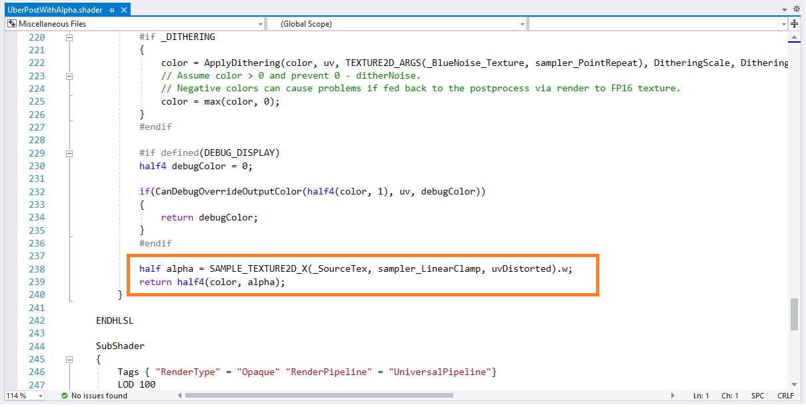
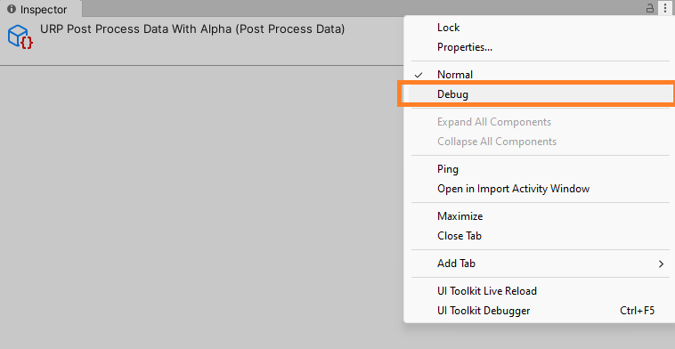
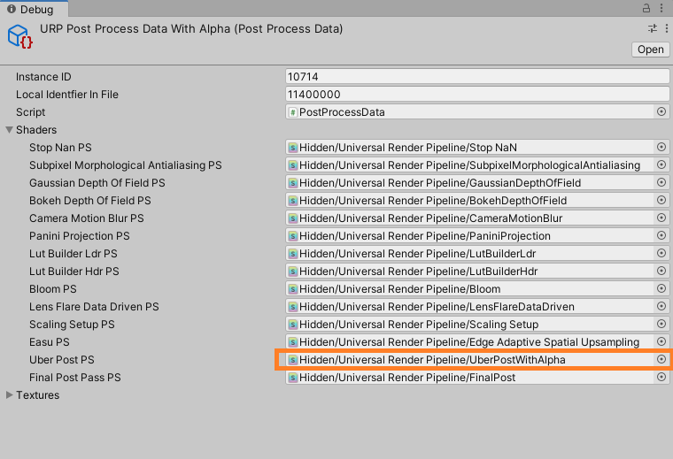
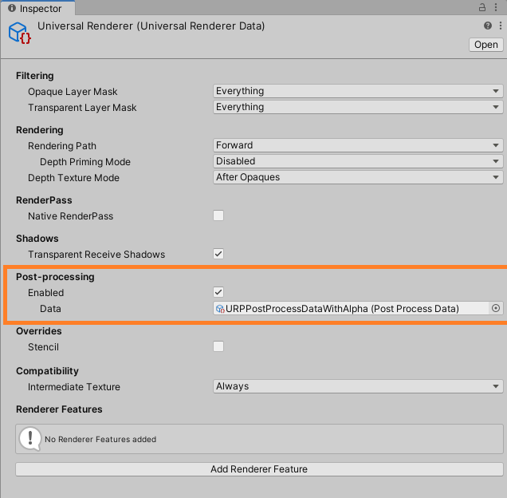
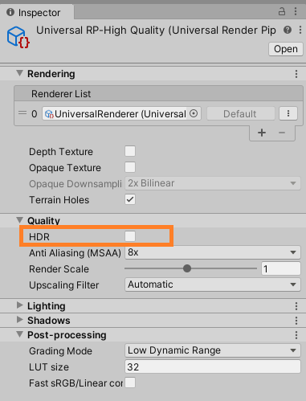
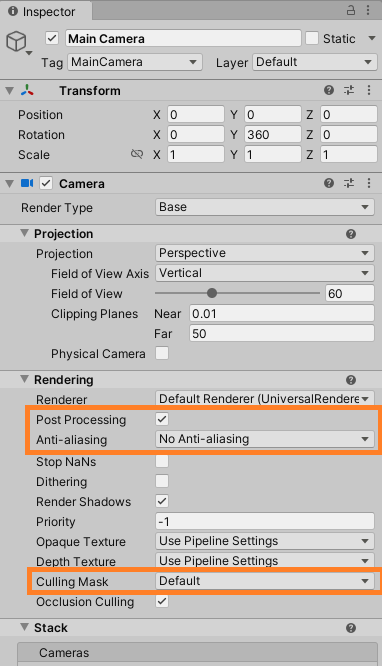

# Device Passthrough

Mixed Reality devices which support passthrough mode, such as Quest 2/Pro/3, can be used with Hololight Stream. To enable this mode, see the Client Settings Documentation on [enabling passthrough](settings.md#enable-passthrough).

## How it Works

In passthrough mode, any objects in the scene with an alpha value of 0 will be treated as passthrough. This means that, regardless the color, objects or skyboxes with an alpha of 0 will not be displayed and replaced with the users surrounding.

In Unity standard render pipelines scenes, skyboxes with solid color and alpha 0 will be treated as passthrough, however for URP and HDRP scenes this will not always be the case. To enable passthrough in URP or HDRP, refer to the following sections.

## Universal Render Pipeline

The following settings must be set to use URP with passthrough.

| Setting | Location | Recommended Value |
|:-|:-|:-|
| Terrain Holes | Universal Render Pipeline Asset | Disabled |
| HDR | Universal Render Pipeline Asset | Disabled |
| Post-processing | Universal Renderer Data | Disabled / Follow steps below |
| Intermediate Texture | Universal Renderer Data | Auto |

### Post-Processing Adaptation

The below steps explain how to adapt the post-processing data for alpha rendering and can be imported from the `Hololight Stream Examples` package via the package manager, see `URPAlphaPassthrough` sample. These steps have been carried out with Unity's Universal Render Pipeline package V12.1.8 and may differ based on the version.

- Copy the `UberPost` shader to the assets, found at `Packages/Universal RP/Shaders/PostProcessing`.
- In the copied shader, change the first line to `Shader Hidden/Universal Render Pipeline/UberPostWithAlpha"` and add below lines, outputing the alpha channel from the shader.

    

- Copy the `Post Process Data` file to the assets, found at `Packages/Universal RP/Runtime/Data`.
- Select the copied `Post Process Data` file and set the inspector to `Debug`, see below.

    

- Expand the `Shaders` section and set the `Uber Post PS` to the copied `UberPost` shader.

    

- Set the `Post Process Data` section of the default Universal Renderer, in the active Render Pipeline Settings specified in the Project Settings Graphic's and Quality Settings, to the copied `Post Process Data` file.

### Example

- Create a 3D URP Unity project (the rest of this section has been done with the `3D Sample Scene (URP)` available in the Unity Hub).
- Add the `com.hololight.stream` and `com.hololight.stream.examples` packages to the project via the package manager.
- Follow the steps in [Project Configuration](../README.md#project-configuration).
- Import the `URPAlphaPassthrough` sample from the `Hololight Stream Examples` package via the package manager.
- Set the `Assets\Settings\Universal Renderer` files `Post Processing Data` section to `URPPostProcessDataWithAlpha`.

    

- Disable the `HDR` checkbox within the `Quality` section of `Assets\Settings\UniversalRP-HighQuality`.

    

- Right click the Scene section and click `XR -> Convert Main Camera to XR Rig` to use the scene with an XR device.
- Go to `XRRig -> Camera Offset -> Main Camera` and, in the `Rendering` section, set:
    - `Post-Processing` to true
    - `Anti-aliasing` to `No Anti-aliasing`
    - `Culling Mask` to `Default`

    

- Go to `XRRig -> Camera Offset -> Main Camera` and, in the `Background` section, set:
    - `Background Type` to `Solid Color`
    - `Background` to zero in `R,G,B and A`
- Enter play mode and connect from the client.

## High Definition Render Pipeline

By default, HDRP does not render alpha information. To enable this, follow the steps below. For more information, see [Unity Documentation on HDRP and Alpha Channel](https://docs.unity3d.com/Packages/com.unity.render-pipelines.high-definition@17.0/manual/Alpha-Output.html).

- Open the `HDRP Asset` in the Inspector window.
- Go to `Rendering > Color Buffer Format`.
- Select `R16G16B16A16`.

## Troubleshooting

- Ensure the passthrough setting has been enabled on the client device, see [enabling passthrough](settings.md#enable-passthrough).
- Ensure both client and server are using the same color space, see [colorspace](settings.md#colorspace).
- Ensure the Main Camera's background is a solid color with **Alpha** value of zero.

## Limitations
- Currently, intermediate alpha values are not supported. Alpha float values will be rounded up, i.e. either 1 or 0.
- Skybox's with a solid color other than black may cause color bleeding on the borders of the objects.
