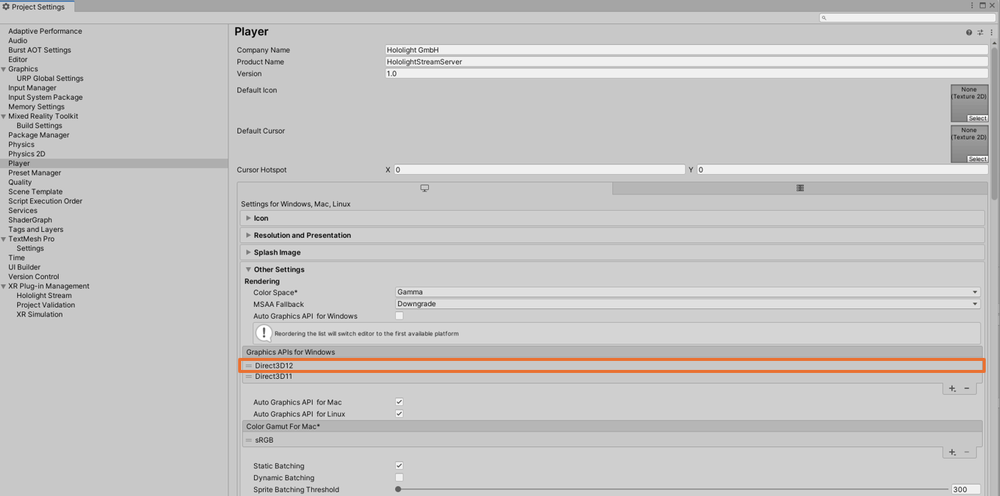

## DirectX 12 Support

Hololight Stream supports DirectX 12 starting from Unity version 2022.2.0a17 which is the first version that officially supports DirectX 12. Additionally, "Single Pass Instanced Rendering" with DirectX 12 is only supported in Unity version 2023.1.0f1.

| Unity Version    | Hololight Stream DirectX 12 Support | Unity Single Pass Instanced Rendering Support |
| --------		   | -------				  | -------      |
| Pre 2022.2.0a17  |❌						 | ❌          |
| 2022.2.0a17 +    |✅						 | ❌          |
| 2023.1.0f1       |✅						 | ✅          |
| 2023.1.0f +      |✅						 | ❌          |

As depicted in the diagram below, you can designate DirectX 12 as the Graphics API by rearranging "Direct3D12" to the top of the list within the "Player Settings" in Unity.

