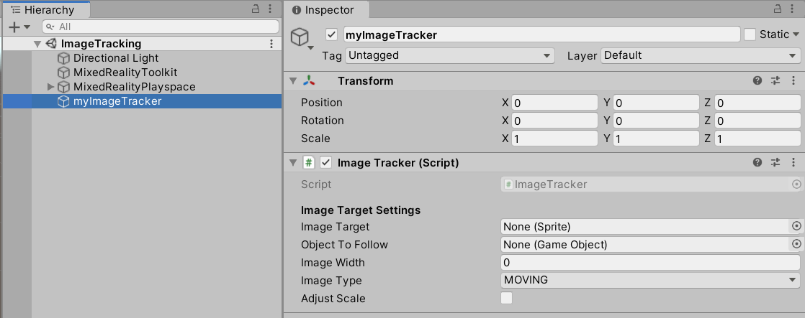

# Image Tracking Support

	

## Overview
The ISAR SDK provides Image Tracking functionality for single or multiple images in parallel. The **Image Tracker** component included in **ISAR Core** should be used for image tracking.

> :warning: Image Tracking is currently only available on the **ISAR Android Client**

## How To Use **ImageTracker**

- Add the Component `ImageTracker` to a GameObject by searching "Image Tracker":

	

- Once added, it will appear within the scene:

	

- Add a sprite to the **Image Target** to specify the image to track
- Press Play, connect with the Android Client, and aim the Camera at an image target
- A cube will appear at the target

### Image Tracker Settings 

**Image Target** - The image/texture that should be tracked.

**Object To Follow** - Can be set to any GameObject. If not set, it will automatically create a cube that will show up where the **Image Target** is found.

**Image Width** - Physical width of the image in meters. Positive numbers will be used to improve tracking.

**Image Type** - Moving images should be set to MOVING, fixed images should be set to STATIC.

**Adjust Scale** - True if the **Object To Follow** should be be scaled down/up to the physical image size, false if not.
