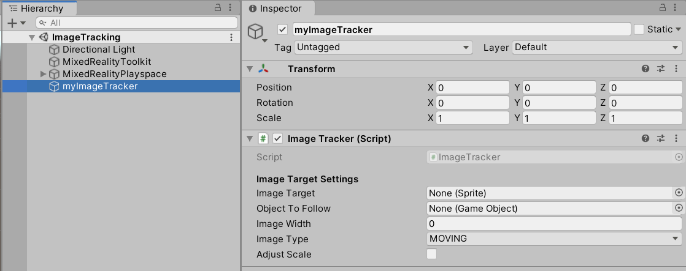

# Image Tracking (Android Clients only)

	

## Overview
Image Tracking is supported by ISAR for **Android Clients**. You can have multiple images tracked parallel. Use the **ImageTracker** Component. 

## How To Use **ImageTracker**

- Add the Component `ImageTracker` to your GameObject by searching "Image Tracker":

	

- It should look like this

	

- Next we need to reference the **Image Target** (You can add any sprite from your Assets)
- Now your **ImageTracker** is ready to work
- Press Play, connect with an Android Client, and aim your Camera to your Image Target, a Cube at that place should appear.

### Image Tracker Settings 

**Image Target** - The image/texture that should be tracked.

**Object To Follow** - Can be set to any GameObject. If not set, it will automatically create a cube that will show up where your Image Target is found

**Image Width** - If you give a positive number then it'll be used to improve tracking. It should be the physical width of the image in meters.

**Image Type** - If your physical image can be moved around, then set it to moving. If your image is fixed on a place, set it to static.

**Adjust Scale** - Set it to true, if you want your **Object To Follow** to be scaled down/up to the physical image size.
