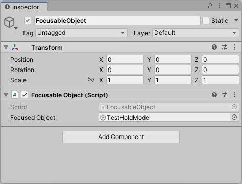
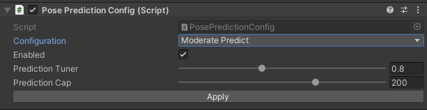

# Object Stabilization

Hololight Stream provides multiple methods to improve the stability of objects within the scene. The following sections discuss these methods and their limitations.

## Focus Plane

A focus plane can be set and used as the focus point for the frame. This helps to improve the visual fidelity of content around this point and should be set every frame. The focus plane can be set through [Unity's XRDisplaySubsystem.SetFocusPlane](https://docs.unity3d.com/ScriptReference/XR.XRDisplaySubsystem.SetFocusPlane.html).

Before setting the focus plane, the [XRDisplaySubsystem.reprojectionMode](https://docs.unity3d.com/ScriptReference/XR.XRDisplaySubsystem-reprojectionMode.html) must first be set to [PositionAndOrientation](https://docs.unity3d.com/ScriptReference/XR.XRDisplaySubsystem.ReprojectionMode.PositionAndOrientation.html). This can be set back to [OrientationOnly](https://docs.unity3d.com/ScriptReference/XR.XRDisplaySubsystem.ReprojectionMode.OrientationOnly.html) to disable focus plane stabilization.

### Example

A sample implementation can be found in the `com.hololight.stream.examples` package called **Object Stabilization**. To use the example, add the package into Unity via the package manager and import the **Object Stabilization** sample.

After importing, a prefab can be found called `FocusableObject`. Put this into the scene and set the object to be focused on the `Focused Object` parameter, see below.

	

### Limitations

- Specifying a focus plane improves the stability of the object at the focus point, however depreciates the stability of non-focused objects. It is the application developers responsibility to handle any logic to switch objects in focus.

- If users are passing through the plane, they will experience undefined behaviour. It is the application developer's responsibility to ensure this does not happen, either by moving the focus plane or disabling it completely.

### Supported Devices

- HoloLens 2
- Magic Leap 2

## Depth based Reprojection (Preview)

Depth based reprojection can be used to improve the stablility of all objects in the scene. This is currently a preview feature and may experience performance drops.

### Limitations

- Reduced performance and increased latency may be experienced
- Overlapping objects which are far apart from each other may experience wavy edges.
- Limited network availablity will result in shaking of the object.

### Supported Devices

- HoloLens 2

## Head Pose Prediction

Head pose prediction (also called pose prediction) involves estimating the future position and orientation of a user's head to provide a smoother and more responsive XR streaming experience. This technique is crucial for reducing latency and ensuring that virtual objects remain stable relative to the user's movements.

### Configuration Example

A sample of how to configure the pose prediction can be found in the `com.hololight.stream.examples` package called **Pose Prediction Config**.  To use the example, add the PosePrediction prefab into the scene.

The prefab has an **Enabled** flag that indicates whether the pose prediction should be enabled or not.

Also the prefab contains two tuning parameters for pose prediction algorithm:

- **Prediction Tuner:** Adjusts the prediction level. Lowering this value can help reduce jitter.
- **Prediction Cap:** Sets the maximum lookahead time in milliseconds for pose prediction. Lower values ensure the prediction does not take effect when latency is high, which helps prevent jitter.

The settings can be adjusted to your preference and make sure to click the 'Apply' button for changes to take effect.

	

### Limitations

- Jitter or instability can occur due to inaccuracies in the prediction model.
- Fast or dynamic movements can exacerbate prediction errors.

### Supported Devices

- HoloLens 2
- Quest 2/3/Pro
- Magic Leap 2
- Lenovo VRX
