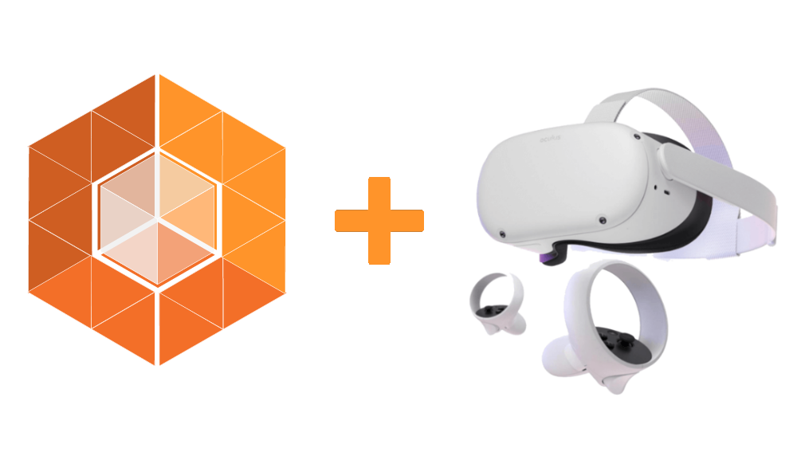
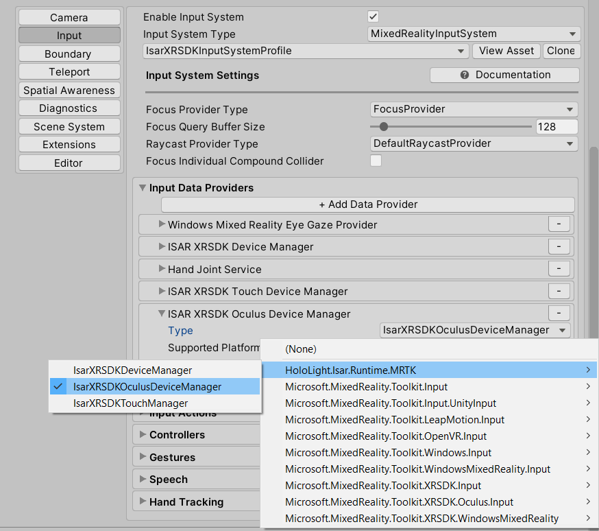
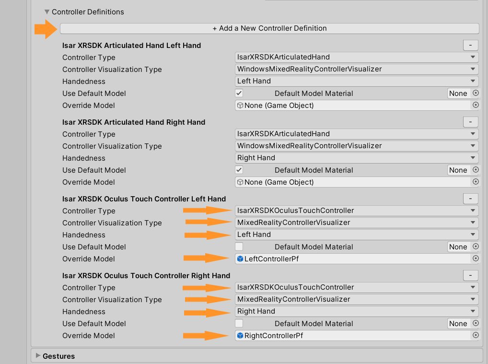
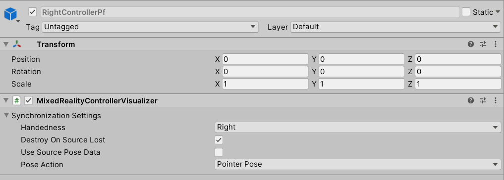

# Oculus Quest 2

<p align="center">
	
</p>

## Overview
ISAR does support Oculus Quest 2 as client device. We Support the Controller (as shown in the picture above) from Oculus Quest 2. 


## How To Enable Controller Support

- To enable the Controller Support, make sure that your MRTK Input Profile does contain the following **Input Data Provider**

<p align="center">
	
</p>

- Type should be set to **IsarXRSDKOculusDeviceManager**
- Current Supported Platforms: **Windows Standalone**, **Windows Universal** and **Windows Editor**
- Do NOT define a Device Manager Profile


## How To Change Controller Visualization

- To change the Models of your Controller, configure the ControllerVisualizationProfile as in the following picture
<p align="center">
	
</p>

- For the Model you can add any GameObject that has the **MixedRealityControllerVisualizer** attached with such configuration

<p align="center">
	
</p>


## How To Use the Joystick of my Controller

Just use it, as it is intended to be used with MRTK. 

Here is an example Code to move an GameObject with the Joystick:

- Create a C# file called **JoystickMover.cs**
- Copy the following code to it. Save.
- Attach that Script to a GameObject you would like to move
- Set **Move Action** to **Teleport Direction**, specify the **Controller Hand** and adjust the **Speed** to your needs.

```csharp
using System.Collections;
using System.Collections.Generic;
using Microsoft.MixedReality.Toolkit;
using Microsoft.MixedReality.Toolkit.Input;
using Microsoft.MixedReality.Toolkit.Utilities;
using UnityEngine;

public class JoystickMover : MonoBehaviour, IMixedRealityInputHandler<Vector2>
{
	public MixedRealityInputAction moveAction;
	public Handedness controllerHand;
	public float speed = 0.1f;

	void OnEnable()
	{
		CoreServices.InputSystem.RegisterHandler<IMixedRealityInputHandler<Vector2>>(this);
	}

	public void OnInputChanged(InputEventData<Vector2> eventData)
	{
		if (eventData.MixedRealityInputAction == moveAction)
		{
			if (eventData.Handedness == controllerHand)
			{
				Vector3 localDelta = speed * new Vector3(eventData.InputData.x, 0, eventData.InputData.y);
				transform.position = transform.position + transform.rotation * localDelta;
			}
		}
	}
}
```

- You need to **Turn off** the **Teleport System** 
- **Press Play**, open the Client App on your Oculus Quest 2 and connect. Move the Joystick(s) to see your GameObject(s) moving :)
- **Happy Coding 🙌🙌🙌**


This example is from here https://stackoverflow.com/questions/56102428/use-of-joystick-teletrasport-of-windows-mixed-reality-controller-in-unity

