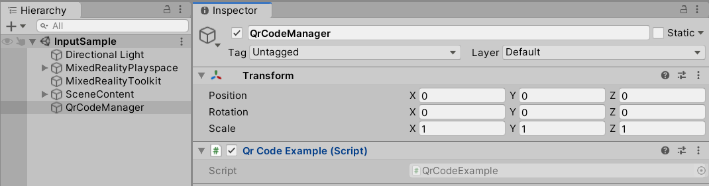

# QR Code Support

<p align="center">
	
</p>

## Overview
The QR Code Tracking supported by ISAR works differently compared to local QR Code Tracking Implementation. Based on the fact, that networking is between client and server, the API is event based. 
The important class to handle all QR Code events is **IsarQr**. 

Example Implementations can be found in **	Isar XR Plugin/Runtime/Examples/QrCodeExample.cs**
This example implements and uses **IsarQr** and simplyfies for you to use it. Adapt it and use it to your needs.

## How To Use **QrCodeExample**

- Add the `QrCodeExample` to an GameObject in your Scene like this:
<p align="center">
	
</p>

- Call **RequestAccess()** to request Users Permission (need to do this only one time - until you reinstall the App or delete App Data). 	 
- Then you just need to call **StartWatching()**.

When QR Codes are found, the functions QrApi_OnAdded, QrApi_OnUpdated, etc. will be triggered. There you can read the content and do what ever you like. 

## How To Use **IsarQr**

If you want to create your own wrapper around IsarQr, feel free to do so. Check out how QrCodeExample is done.
It is very similar to the <a href="https://docs.microsoft.com/en-us/uwp/api/Windows.Devices.Enumeration.DeviceWatcher?view=winrt-19041">DeviceWatcher class</a> from Microsoft.

Create an instance of IsarQr and register for the events.
```csharp
_isar = new IsarQr();
_isar.ConnectionStateChanged += OnConnectionStateChanged;
_isar.QrCodeAdded += QrApi_OnAdded;
_isar.QrCodeUpdated += QrApi_OnUpdated;
_isar.QrCodeRemoved += QrApi_OnRemoved;
_isar.QrCodeEnumerationCompleted += QrApi_OnEnumerationCompleted;
_isar.QrCodeAccessStatusReceived += QrApi_OnAccessStatusReceived;
_isar.QrCodeIsSupportedReceived += QrApi_OnIsSupportedReceived;
```


Call **IsarQr.Start()** to tell the HoloLens to start searching for QR Codes.
When it has found some, it will trigger the corresponding events.

Call **IsarQr.RequestAccess()** to ask Permission from User to scan for QR Codes. 
This is needed only one time for the first use. The Status is saved through different App Session cycles. 

Call **IsarQr.Stop()** if you don't need to track the QR Codes anymore.

Inside the update function call **IsarQr.ProcessMessages()**
```csharp
private void Update()
	{
		if (_isar.IsConnected)
		{
			_isar.ProcessMessages();
		}
	}
```

That's basically it. Please have a look at the implementation of **QrCodeExample.cs** if you encounter issues.