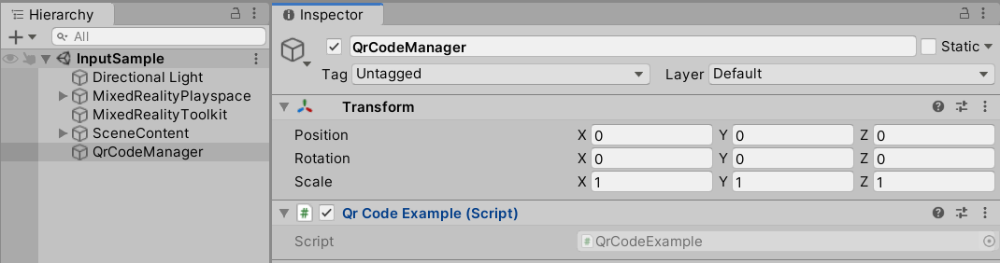

# QR Code Support

<p align="center">
	
</p>

## Overview
The ISAR SDK provides functionality to scan QR Codes in the physical environment and receive the information within Unity to be processed.

The `IsarQr` class, included with the **ISAR Core** package, provides an easy access method to retreive QR Code data. For information on how to use this class, follow the description below. It is recommended to follow the **QrCodeExample** for best example usage of this class.

## How To Use `IsarQr`

The `IsarQr` class contained within **ISAR Core/Runtime** provides an easy access implementation for receiving QR Codes. This class operates similar to the <a href="https://docs.microsoft.com/en-us/uwp/api/Windows.Devices.Enumeration.DeviceWatcher?view=winrt-19041">DeviceWatcher class</a> from Microsoft, triggering events to be consumed when a QR Code appears within the physical environment. This class can be used as is, or overridden to implement more advanced functionality.

Create an instance of IsarQr and register for the events.
```csharp
_isar = new IsarQr();
_isar.ConnectionStateChanged += OnConnectionStateChanged;
_isar.QrCodeAdded += QrApi_OnAdded;
_isar.QrCodeUpdated += QrApi_OnUpdated;
_isar.QrCodeRemoved += QrApi_OnRemoved;
_isar.QrCodeEnumerationCompleted += QrApi_OnEnumerationCompleted;
_isar.QrCodeAccessStatusReceived += QrApi_OnAccessStatusReceived;
_isar.QrCodeIsSupportedReceived += QrApi_OnIsSupportedReceived;
```

Call `IsarQr.RequestAccess()` to request permission from user to scan for QR Codes. 
The user's permission is requested once and saved for use across all app session lifecycles.

Call `IsarQr.Start()` to start scanning for QR Codes. When a code is found, an event will trigger passing the scanned data.

Call `IsarQr.Stop()` to stop scanning for codes.

Within the Unity `Update()` method, call `IsarQr.ProcessMessages()` to process QR Codes on the server.
```csharp
private void Update()
	{
		if (_isar.IsConnected)
		{
			_isar.ProcessMessages();
		}
	}
```

For more information regarding usage of the `IsarQr` class, see example implementation **Isar Core/Runtime/Examples/QrCodeExample.cs**.

## How To Use **QrCodeExample.cs**

The QR Code example demonstrates how to use the `IsarQr` class to retrieve Qr Code data. It is recommended to copy and adapt this example for personal usage.

The following instructions explain how to setup the project to scan and retrieve QR Codes:
- Add the `QrCodeExample` to a GameObject in the Scene:
<p align="center">
	
</p>

- Call **RequestAccess()** to request Users Permission on the client (only required first run). 	 
- Call **StartWatching()** to begin watching for QR codes within the environment.

When a QR Code is found, the events `QrApi_OnAdded`, `QrApi_OnUpdated`, etc. will be triggered. The QR Code content can be parsed and processed within the event handler. 

