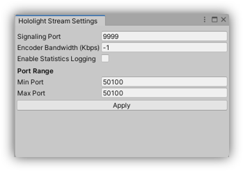

# Settings

## Server Settings

To configure the server side settings, click `Hololight -> Stream -> Configure Settings`. A settings windows as illustrated below will be shown.

	

### Signaling Port

The signaling port allows the user to specific the port to be used for the signaling process. The number must be between 1024 and 65535 and if unset, is default to 9999. If desired, this value can be set to the same as that specified in [Port Range](#port-range), limiting the number of ports required to be exposes from the firewall.

### Encoder Bandwidth

The encoder bandwidth specifies the maximum bitrate which the encoder will be ran at. A higher number will provide better image quality, however too high can effect network performance. It is recommended to keep this value in the range of 10,000 - 100,000 Kbps for optimum quality/performance. If a value of -1 is specified, the bandwidth will be taken from the client settings, see [Client Bandwidth Setting](#bandwidth).

### Statistic Logging

When enabled, a number of statisics will be logged to a CSV file to aid networking investigations. The file will be stored in `<application_root_dir>/hls-stats/` and can be analysed within excel.

It is recommended to only enable this setting when investigating potential issues as it may have a performance impact. To enable this setting in a build application, specify `stats-collector` in the `diagnostic-options` section of the config file, see [Configuration File](#configuration-file).

| Statistic | Description |
| :--- 	    | :--- |
| Timestamp | The timestamp since epoch the stats were gathered |
| Frame Rate | The rate frames are being received at the encoder |
| Encoder Target Bitrate | The bitrate which has been configured for the encoder. This usually corresponds to the bitrate set in [Encoder Bandwidth](#encoder-bandwidth) |
| Available Outgoing Bitrate | The estimated bandwidth the network is capable of achieving |

### Port Range

The port range allows the user to specific the ports which can be used for the running connection. The range must be between 1024 and 65535 and it is possible to set a single port by specifying the miniumum and maximum as the same value. By default, the port is set to 50100. If desired, this value can be set to the same as that specified in [Signaling Port](#signaling-port).

### Configuration File

After building the project, the settings above can be edited, with any text editor, through the `remoting-config.cfg` file in the `StreamingAssets` folder. The configuration file is in standard JSON format, more information can be found at [JSON.org](https://www.json.org/json-en.html).

## Client Settings

To configure the client side settings, see the settings tab of the client UI.

> **_NOTE:_** Not all settings are available on every client. The below describes the combined settings from all clients.

### Default Port

The default port specifies the port which will be used for signaling. This port must be the same as was specified in [Server Signaling Port](#signaling-port).

### Timeout

The timeout specifies the the amount of time a connection will be attempted. If this time is reached and no connection has been extablished, the connection will be aborted.

### Bandwidth

The maximum bandwidth which will be used during the connection. A scale of low, medium and high is provided with suggested values for optimal quality, however the a custom value can also be provided. If a server bandwidth is set, see [Server Bandwidth](#encoder-bandwidth), this value will be ignored.

### Enable Passthrough

On devices which support passthrough, enabling this setting will render the object in the real world. For more information, see [Device Passthrough Documentation](device_passthrough.md).

### Advanced Settings

#### Preferred Codec

Specifies the codec which would be preferred to be used. The preference will only be used if both sides support the codec type.

#### Colorspace

Specifies the color space which is used for rendering. This should be the same as specified in Unity.

#### Latency Logging

Enable logging of latency information to a CSV file stored on the client device to aid with networking investigations.

#### Depth Buffer (Preview)

Enables sending of the depth buffer from server to client to make use of depth reprojection. For more information, see [Depth Reprojection](object_stabilization.md#depth-based-reprojection-preview).

