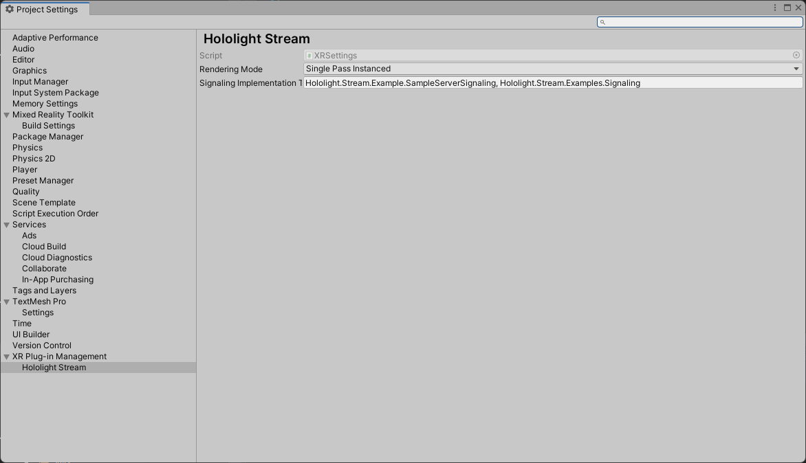

# Signaling

In order to establish a connection with a remote peer, connection information must first be exchanged. This process is called Signaling (for more information see [WebRTC - Signaling](https://www.tutorialspoint.com/webrtc/webrtc_signaling.htm)).

Developers may provide their own signaling implementation to be used by Hololight Stream to establish a connection with a remote peer. A sample implementation has been provided and can be found within the `com.hololight.stream.examples/Samples/Signaling` directory. If no signaling implementation is provided, a default implementation will be instantiated, see [Default Signaling](signaling.md#default-signaling-implementation).


## Default Signaling Implementation

If no signaling implementation is provided, Hololight Stream instantiates a default implementation. The default is a generic TCP socket that sends and receives signaling related messages over network. It uses the configured port as described in the [Signaling Port](../README.md#signaling-port) section.

> :warning: Please note that default signaling implementation does not provide any encryption on the signaling messages that are sent and received.

## Signaling Base Class

An abstract base class, `Signaling`, has been provided and must be inheritted from when implementing signaling. This base class can be found in the folder `com.hololight.stream/Runtime/Signaling` and is named `Signaling.cs`. The details of the functions of this class are explained below.

```
using namespace HoloLight.Isar.Signaling
public class SampleSignaling : Signaling
{
    /// Implementing code here
}
```

The following will be called by Hololight Stream:
- `Start` will be called to begin the signaling process.
- `Stop` will be called to stop the signaling process. This will be either when a connection is established or when the application has been closed.
- `ConnectionChanged` will be called when the Hololight Stream connection state changes. The usage of this callback is at the discretion of the implementor.
- `SendSdp` will be called to request that the SDP string is sent to the remote end.
- `SendIceCandidate` will be called to request that the ICE candidate information is sent to the remote end.

The following can be called by the implementator:
- `SetConnectionState` will notify Hololight Stream about the signaling connection state. When called with a `true` connection state, Hololight Stream will asynchronously call `SendSdp` and `SendIceCandidate` to pass information to the remote endpoint. In situations where the implementor wishes to carry out additional information exchange prior to Hololight Stream's information, this call can be delayed until the exchange is complete.
- `SetRemoteSdp` will notify Hololight Stream about the obtained remote SDP.
- `SetRemoteIceCandidate` will notify Hololight Stream about an obtained remote ICE candidate.

## Specifying Implementation

The signaling implementation can be specified within the Hololight Stream XR Project Settings, see image below. The implementation must be passed with the full path, including namespace, to allow construction via reflection.

> **_NOTE:_** To specify the Hololight Stream Sample Signaling, enter "Hololight.Stream.Example.SampleServerSignaling, Hololight.Stream.Examples.Signaling" in the `Signaling Implementation Type` box.

<p align="center">
	
</p>

The implementation will be constructed and owned by the Hololight Stream XR Loader, `IsarXRLoader` class. A property, `Signaling`, is exposed by  the loader which exposes the constructed object. This can be used to directly interface with the implementation specified within the settings file. For more information regarding the XR Loader and how to access it, see [XRManagerSettings](https://docs.unity3d.com/Packages/com.unity.xr.management@2.0/api/UnityEngine.XR.Management.XRManagerSettings.html).

## Sample Unity Server Signaling

As stated above, a sample server signaling implementation is provided to ease implementation. By default, this will be used if no other implementation is provided.

The sample uses a simple TCP server which listens to a client on any local IP address. It sends the Hololight Stream information in XML format and prepends each message with the length of the XML string in big-endian format. This implementation can only be used with the default client signaling implementations provided.

The source code of this sample can be found at `com.hololight.stream/Runtime/Signaling/SampleServerSignaling.cs`.

> :warning: Please note, this implementation is a sample that does not provide encryption of messages. It is recommended to use a dedicated signaling server implementation with proper encryption for production environments.

```
using namespace HoloLight.Isar.Signaling
public class SampleServerSignaling : Signaling
{
    // TCP connection related declarations & functions

#region Signaling Overrides
	// Overriden functions from SignalingImpl base class
	public override void Start(string suggestedIPV4, uint suggestedPort)
	{
		Task.Run(async () =>
		{
			try
			{
				// For server side ip arguement is ignored.
				await ListenAsync(IPAddress.Any, (int)suggestedPort);
			}
			catch (ObjectDisposedException)
			{
				// This will occur when we stop the tcp listener. This indicates a closing of the server.
			}
			catch (SocketException socketEx)
			{
				// Something went wrong at the socket level. Log the reasonsing
				Debug.LogError($"Socket exception: {socketEx.Message}");
			}
		});
	}

	public override void Stop()
	{
		StopTcpConnection();
	}

	protected override void ConnectionChanged(IsarConnectionState state)
	{
		Debug.Log("Connection state changed: " + state.ToString());
	}

	protected override void SendSdp(string sdp)
	{
		Task.Run(async () => await SendQueuedAsync(SendSdpAsync(sdp)));
	}

	protected override void SendIceCandidate(string id, int lineIndex, string candidate)
	{
		Task.Run(async () => await SendQueuedAsync(SendIceCandidateAsync(id, lineIndex, candidate)));
	}
#endregion
}
```
