# Spatial Anchors

ISAR supports use of spatial anchors in Unity for use with HoloLens 2 client and contains the implementation of Unity's AR Subsystems which provide the functionality requested by AR Foundation. [ISAR Core](arfoundation.md) includes associated spatial anchor subsystem for the required functionality.

> :warning: This feature is only supported for the HoloLens 2 OpenXR Client. For more information, [make a request](https://holo-light.com/contact).

## Getting Started

### Scene Configuration

- Follow the steps in [AR Foundation](arfoundation.md#scene-configuration).
- Expand the **AR Session Origin** object and add the **AR Anchor Manager** to it. For more information on using the AR Anchor Manager, see the description https://docs.unity3d.com/Packages/com.unity.xr.arfoundation@4.1/manual/anchor-manager.html."
- Make sure to set **Anchor Prefab** on **AR Anchor Manager**. As example, there is already  **Spatial Anchor Object** prefab object that can be used, which can be found at `Packages/ISAR Examples/Anchor`

### Testing Functionality
A pre-built scene can be found at `Packages/ISAR Examples/Anchor/Anchoring Sample Scene` to test the anchoring functionality. To integrate the example into an existing scene, add the **Anchor Example** prefab in the scene which can be found at `Packages/ISAR Examples/Anchor/`. 

#### Creation & Deletion of Spatial Anchors

- When the application is run there should be a control panel and a spatial anchor creator object ( transparent blue sphere ) in your surroundings as can be seen below images. 
&nbsp;
  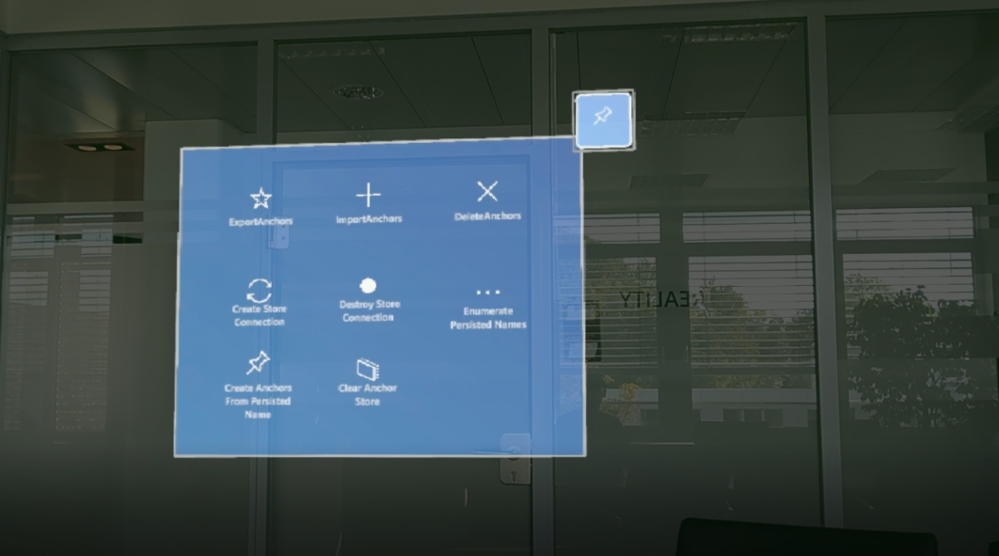
&nbsp;
&nbsp;
&nbsp;
- The creator object can be moved by dragging it with hand interaction and the button on top of the object, labeled `Create Anchor`, creates a spatial anchor at that position. The anchor's original location and orientation are preserved by the client device, updating its location and orientation periodically. This behaviour can be observed above each of the created anchors:
&nbsp;
  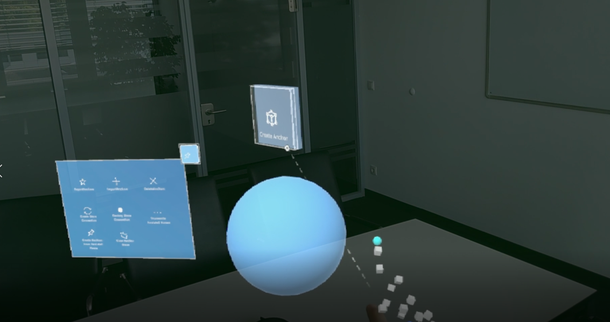
  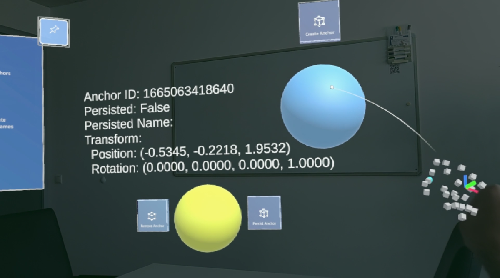
&nbsp;
&nbsp;

- Created spatial anchor objects can be seen in the user's surroundings as yellow transparent spheres, illustrated in the image below. The `Remove Anchor` and `Persist Anchor` buttons allow users to remove the anchor from system and persist the anchor on the client device, respectively.
&nbsp;
  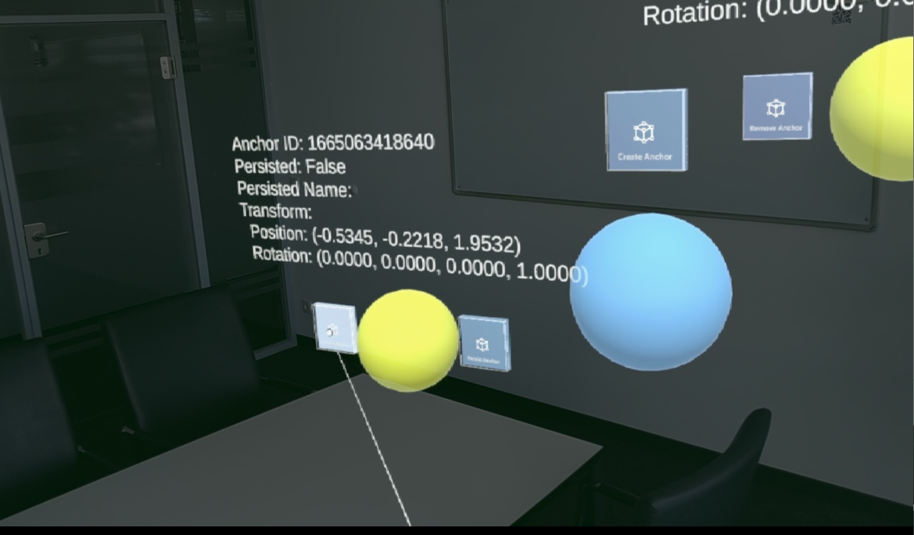
&nbsp;
&nbsp;

- Alternatively, you can delete all spatial anchors in running aplication by clicking `Delete Anchors` from the control panel as can be seen below:
&nbsp;
  
&nbsp;

#### Export & Import of Spatial Anchors

- All created spatial anchors can be exported from the client device and stored in a binary file for future usage. In the example, clicking the `Export Anchors` button in control panel will download the file from the client and store it in `Packages/ISAR Examples/Anchor/data.isa`. This operation may take a long time, increasing with the number of anchors, therefore the function accepts a timeout argument. It is the responsibility of the developer to provide an appropriate timeout value for their scenario, see `\Packages\com.hololight.isar\Runtime\Examples\SpatialAnchor\ISARAnchorExampleUtils.cs` for more information about how to control the timeout logic.
&nbsp;
  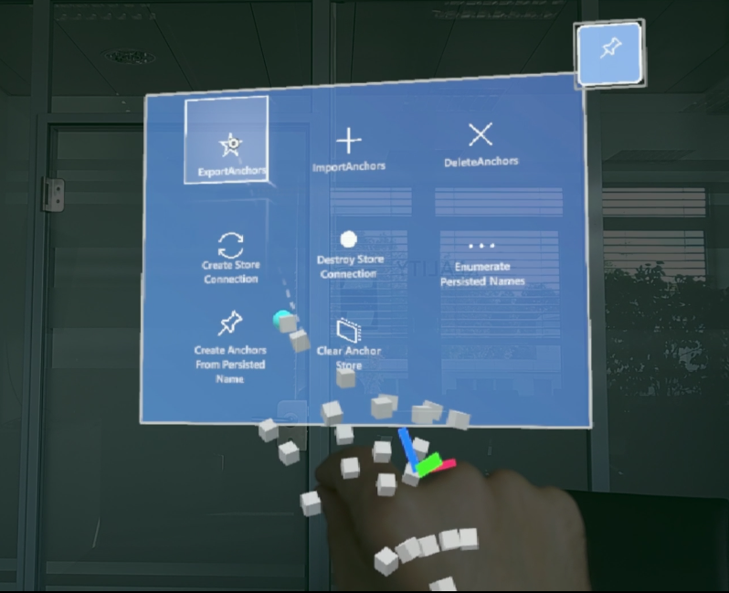
  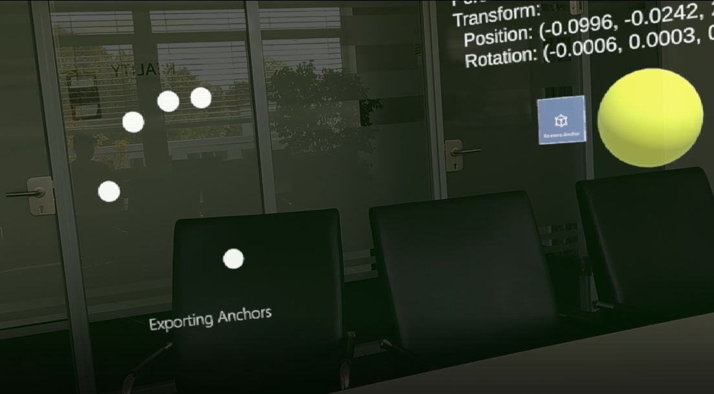
  
&nbsp;
&nbsp;

- Exported spatial anchors data can be imported onto the client device to load previously established spatial anchors back into the user's surroundings. In the example, clicking the `Import Anchors` button will upload the anchors data file `Packages/ISAR Examples/Anchor/data.isa` to the client device. This operation may also take a long time, increasing with the number of anchors, therefore the function accepts a timeout argument. It is the responsibility of the developer to provide an appropriate timeout value for their scenario, see  `Packages/ISAR Examples/Anchor/ISARAnchorExampleUtils.cs` for more information about how to control the timeout logic.
&nbsp;
  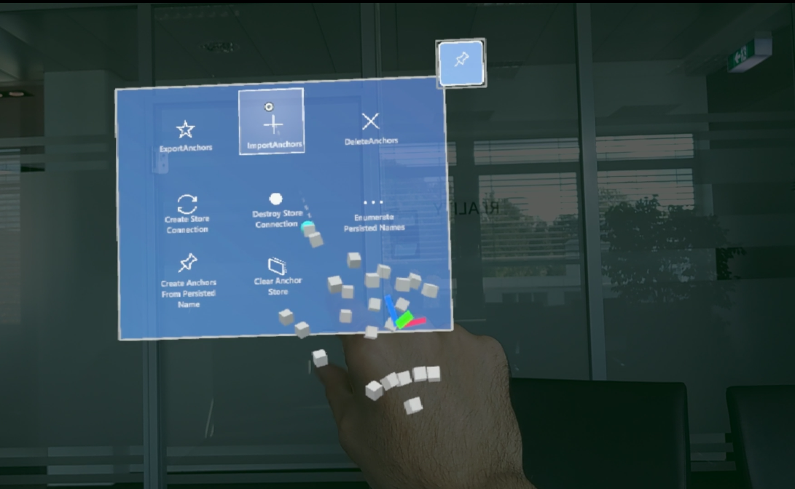
&nbsp;
&nbsp;

** Note: ** Exporting/Importing can sometimes fail due to network conditions. It is recommended to catch failed exports/imports and retry the action.

#### Persisting Anchors on HoloLens2 Spatial Anchor Store

- An alternative to exporting and importing anchor data is to persist the anchors directly on the client device. Persisted anchors are stored per application and exist on the device for duration of the application being installed. In order to begin, persisting anchors, a connection to the client's spatial anchor store must first be established. This can be done by clicking the `Create Store Connection` button from control panel, as illustrated below:

&nbsp;
  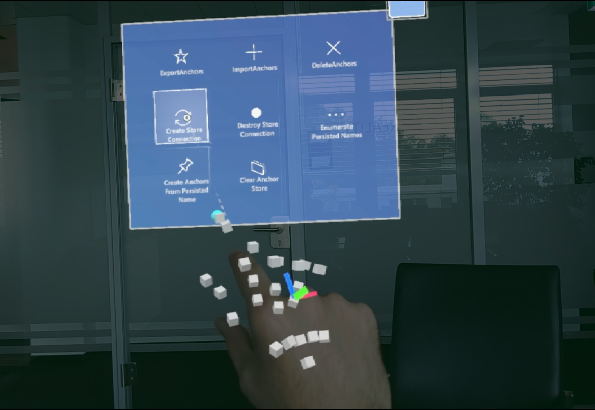
  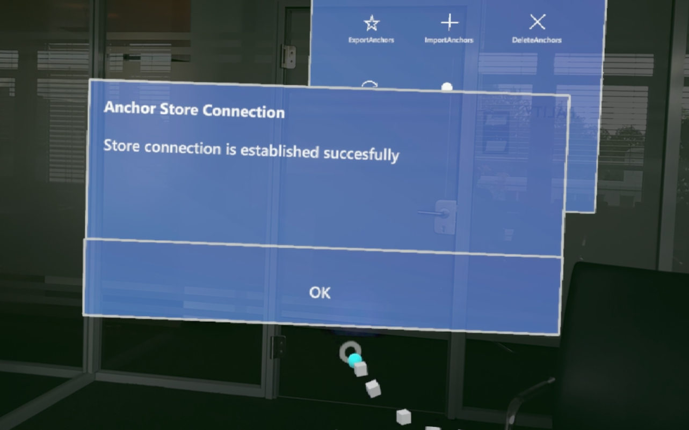
&nbsp;
&nbsp;

- Each created spatial anchor (transparent yellow sphere) has a button labeled `Persist Anchor` which will tell the client device to persist the anchor to it's store. Pressing this button will change the color of the anchor to green and add additional persistent related information in the text above. Additionally, a button labeled `Unpersist Spatial Anchor` is provided to remove a persisted anchor from the store. These buttons are shown in the image below:

&nbsp;
  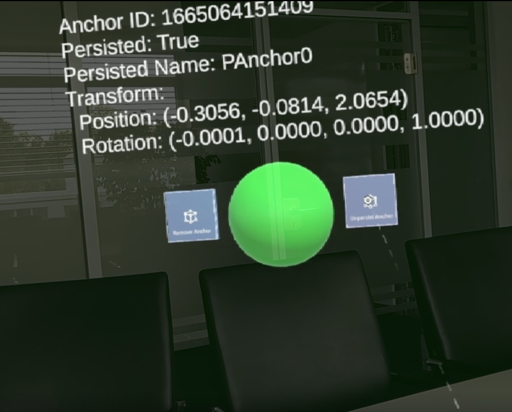
&nbsp;

- The control panel contains additional functionally for interacting with spatial anchors:

  - **`Enumerate Persisted Names`**: Queries the persisted anchor names from the spatial anchor store on device:
  &nbsp;
    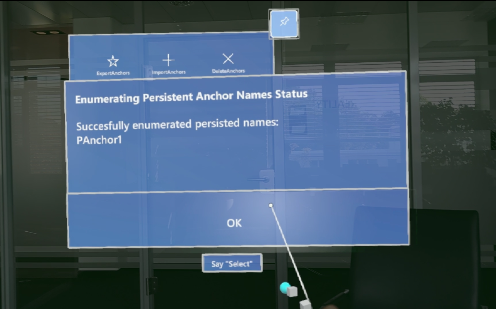
  &nbsp;
  - **`Create Anchors From Persisted Names`**: Load all the persisted anchors from anchor store of client device
  &nbsp;
  - **`Clear Anchor Store`**: Clears all persisted anchor data from the client device.
    &nbsp;

#### Example Scripts & Prefabs 

- Example scene, prefabs & associated scripts regarding spatial anchors can be found at `Packages/ISAR Examples/Anchor` as can be seen below:

  &nbsp;
    
    
  &nbsp;

- As has been mentioned above, some of the functions require a timeout argument to indicate the length of time to wait until giving up on a function. For examples on how this timeout should be used, see `ISARAnchorExampleUtils.cs` & `ISARAnchorPersistenceUtils.cs`.

- Additionally, the file name and the file path for export & import functions that explained above is defined in `ISARAnchorExampleUtils.cs` file which can be changed upon the needs of the test scenario
