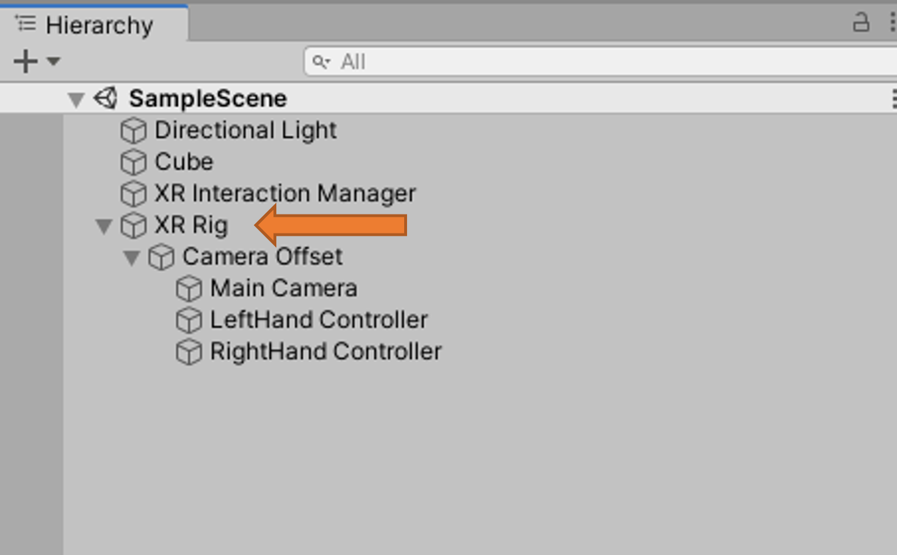

# Unity's XR Interaction Toolkit

Hololight Stream supports Unity's [XR Interaction Toolkit](https://docs.unity3d.com/Packages/com.unity.xr.interaction.toolkit@0.9/manual/index.html) and [Input System](https://docs.unity3d.com/Packages/com.unity.inputsystem@1.0/manual/QuickStartGuide.html).

## Getting Started
### Prerequisites

- [Prerequisites](README.md#prerequisites)
- XR Interaction Toolkit (tested with 1.0.0-pre.5)

### First Installation

1. Follow the steps listed in [First Installation](README.md#first-installation)
2. Import XR Interaction Toolkit into project via **Package Manager**

### Project Configuration

Follow the steps listed in [Project Configuration](README.md#project-configuration).

### Scene Configuration

When configuring the scene, or setting up action bindings, all bindings must be made to the **XR Controller** path. Bindings to paths other than **XR Controller** are not guaranteed to be supported. For more information on action bindings, see [Unity's Documentation](https://docs.unity3d.com/Packages/com.unity.inputsystem@0.2/manual/ActionBindings.html).

- In the Scene, add an **XR Rig** (`GameObject -> XR -> Room-scale/Stationary XR Rig (Action-based)`) selecting:
	- **Room-scale** for users who will be standing
	- **Stationary** for users who will be sat
- An **XR Rig** GameObject will appear in the scene

	

- Confirm the **Main Camera** (`XR Rig -> Camera Offset -> Main Camera`) **Tracked Pose Driver** component is as below

	

- Set up action bindings for the **Left/RightHand Controller** (`XR Rig -> Camera Offset -> Left/RightHand Controller`), see the left hand example set up below. This example binding has been taken from the bindings in WorldInteractionDemo scene from [Unity's XR Interaction Toolkit Examples](https://github.com/Unity-Technologies/XR-Interaction-Toolkit-Examples)

	

#### Change Controller Visualization

- Select the controller which should be changed, i.e. **Left/RightHand Controller**
- Set the model within `XR Controller (Action-based) -> Model -> Model Prefab` to the intended controller model

	

### First Run

Follow the steps listed in [First Run](README.md#first-run).

## Troubleshooting
The below list contains specific issues that may occur when running the Hololight Stream SDK with Unity's new XR Interaction Toolkit and Input System. For all other troubleshooting issues, see [Troubleshooting](README.md#troubleshooting).

-  The **Game** view requires window focus when running in the editor. If focus is not given, input data will not be updated.
