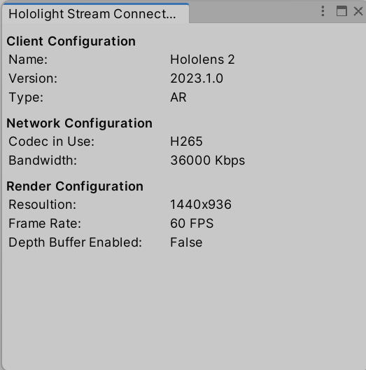

    

Hololight Stream is a powerful remote rendering solution designed to stream high-quality XR experiences from local servers or cloud-based infrastructure. Stream entire AR or VR applications, visualize high-polygon content, and use its cross platform compatibility to support AR/VR glasses, smartphones, and tablets.

## Getting Started

### Prerequisites

- Minimum Unity 2020.3.x

### First Installation

1. Open an existing Unity 3D project or create a new one
2. Remove previous versions of Hololight Stream (previously ISAR) from the project (skip this if the project does not currently have Hololight Stream installed)
    - Open **Package Manager** in the Unity editor (`Window -> Package Manager`)
    - Find the **Hololight Stream** (or **ISAR**) package and choose **Remove**
3. Import **Hololight Stream** into the project
    - Open **Package Manager** in the Unity editor (`Window -> Package Manager`)
    - Click the **+** then **Add package from tarball...** and select the file `com.hololight.stream-<version>.tgz`, where version is the current version, from the `Packages` directory contained in this repository
4. Add the desired toolset following the instructions below
    - [MRTK](/Docs/mrtk_extension.md)
    - [XR Interaction Toolkit](/Docs/xr_interaction_toolkit.md)

### Project Configuration

1. Navigate to `Edit -> Project Settings -> XR Plug-in Management`
    - Enable **Hololight Stream**
2. Open `File -> Build Settings...`
    - Ensure the following configuration is selected:
        - Platform: **PC, Mac & Linux Standalone** + Architecture: **x86_64**

### Hololight Stream Configuration

#### Settings

The connection settings can be edited through the settings windows on both client and server. To find out more, see the [Settings Documentation](/Docs/settings.md).

#### Connection Information

Information about the connection can be seen on Hololight Stream Connection Info window. To open, click `Hololight -> Stream -> Connection Info`.

	

### First Run

Enter play mode in the Unity editor or build a standalone application with the following settings:

- Platform: **PC, Mac & Linux Standalone**
- Target Platform: **Windows**
- Architecture: **x86_64**

### Disabling Hololight Stream

Hololight Stream can be disabled while remaining as a package in the project. To do so, follow the below steps:

- Click `Edit->Project Settings` and move to the **XR Plug-in Management** section
- Uncheck **Hololight Stream**
- Check **Unity Mock HMD**
- Ensure not to call the `Isar` class, or any of the inherited classes (`IsarViewPose`, `IsarAudio`, etc.), constructor within the code

## Clients

Hololight Stream supports several clients that can connect to the server. For information on installing and connecting with specific clients, refer to [Clients](/Docs/clients.md).

## Example

A preconfigured example is available within the repository. For information on how to load this example, refer to [Example](/Docs/example.md).

Furthermore, the `Hololight Stream Examples` package contains example scenes, prefabs, scripts and associated resources to demonstrate the features within Unity.

## Additional Features

Hololight Stream supports a number of additional features. Below illustrates where to find the appropriate documentation for each feature:

- [Object Stabilization](/Docs/object_stabilization.md)
- [Unity Audio Stream](/Docs/unity_audio_stream.md)
- [Client Camera Stream](/Docs/client_device_camera.md)
- [Client Microphone Stream](/Docs/microphone.md)
- [AR Foundation](/Docs/ar_foundation.md)
- [QR Code Tracking](/Docs/qr_code.md)
- [Speech Recognition](/Docs/speech_recognition.md)
- [iOS Occlusion](/Docs/occlusion.md)
- [Custom Extensions](/Docs/data_channels.md)
- [Device Passthrough](/Docs/urp_hdrp_alpha_passthrough.md)

## Troubleshooting

- If the client fails to connect, check the IP address is entered correctly (e.g. 192.168.0.122).
- Check if the Firewall is blocking the connection. The fireware must be disabled for the ports specified in [Signaling Port](#signaling-port) and [Port Range](#port-range).
- If the Unity editor crashes when trying to run the app and Hololight Stream is not required but is still in the project, follow the steps in [Disabling Hololight Stream](#disabling-hololight-stream) to debug the issue.
- If using a **HDRP** project and the `Main Camera` is not moving, remove the `SimpleCameraController` script attached to the `Main Camera`.
- When opening the HelloStream project for the first time, a missing reference to **com.hololight.stream** may be flagged. If this occurs:
  - Press **Continue** and wait until the project finishes loading
  - Once the project has loaded, follow the steps in [First Installation](#first-installation) to add Hololight Stream to the example

## License
By downloading/using/evaluating Hololight Stream, you agree to the [proprietary license terms and conditions](/Licenses/HololightStream.txt). Licensing information can be found in the "Licenses" directory of this repository.

## Usage Outside Unity
The following documentation specifically references usage with the Unity Game Engine, however Hololight Stream can be used independently of Unity. For more support regarding usage outside of Unity, please [contact us](https://hololight.com/contact).
